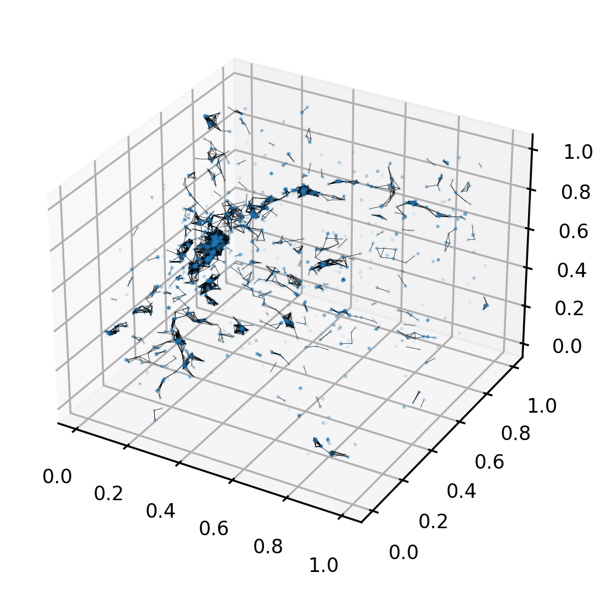

# CosmoGraphNet

Graph Neural Networks to predict the cosmological parameters and the galaxy power spectrum from galaxy catalogues.

A graph is created from a galaxy catalogue with information about the 3D position and intrinsic galactic properties. A Graph Neural Network is then applied to infer the cosmological parameters or the galaxy power spectrum. Galaxy catalogues extracted from the [CAMELS](https://camels.readthedocs.io/en/latest/index.html) hydrodynamic simulations, specially suited for Machine Learning purposes. Neural nets architectures are defined making use of the package [PyTorch-geometric](https://pytorch-geometric.readthedocs.io/en/latest/).

See the paper [arXiv:2204.xxxxx](https://arxiv.org/abs/2204.xxxxx) for more details.

## Description of the codes

Here is a brief oveview of the codes included:

- `main.py`: main driver to train and test the network.

- `hyperparameters.py`: script with the definition of the hyperparameters employed by the networks.

- `crosstest.py`: tests a pre-trained model.

- `hyperparams_optimization.py`: optimize the hyperparameters using `optuna`.

- `ps_test.py`: tests the power spectrum neural networks in point distributions with different clustering properties.

- `visualize_graphs.py`: display graphs from galaxy catalogues in 2D or 3D.

The folder `Source` contains scripts with auxiliary routines:

* `constants.py`: basic constants and initialization.

* `load_data.py`: contains routines to load data from simulation files.

* `plotting.py`: includes functions for displaying the results from the neural nets.

* `metalayer.py`: includes the definition of the Graph Neural Networks architecture.

* `training.py`: includes routines for training and testing the net.

## Requisites

The libraries required for training the models and compute some statistics are:
* `numpy`
* `pytorch`
* `pytorch-geometric`
* `matplotlib`
* `scipy`
* `sklearn`
* [`optuna`](https://optuna.readthedocs.io/en/stable/index.html) (only for optimization in `hyperparams_optimization.py`)
* [`Pylians`](https://pylians3.readthedocs.io/en/master/) (only for computing power spectra in `ps_test.py`)

## Usage

The codes implemented here are designed to train Graph Neural Network for two tasks. The desired task is chosen in `hyperparameters.py` with the `outmode` flag:
1. Infer cosmological parameters from galaxy catalogues. Set `outmode = "cosmo"`.
2. Predict the power spectrum from galaxy catalogues. Set `outmode = "ps"`.

These are some advices to employ the scripts described above:
1. To perform a search of the optimal hyperparameters, run `hyperparams_optimization.py`.
2. To train a model with a given set of parameters defined in `hyperparameters.py`, run `main.py`. The hyperparameters currently present in `hyperparameters.py` correspond to the best optimal values for each suite when all galactic features are employed (see the paper). Modify it accordingly to the task.
3. Once a model is trained to perform cosmological parameter inference, run `crosstest.py` to test in the training simulation suite and cross test it in the other one included in CAMELS (IllustrisTNG and SIMBA). It needs a pretrained model.
4. If a model has been trained to predict the power spectrum from CAMELS galaxy catalogues, evaluate its extrapolation performance on different point distributions running `ps_test.py`. It needs a pretrained model.

## Citation

If you use the code, please link this repository, and cite [arXiv:2204.xxxxx](https://arxiv.org/abs/2204.xxxxx) and the DOI [10.5281/zenodo.6485804](https://doi.org/10.5281/zenodo.6485804).

## Contact

Feel free to contact me at <pablo.villanueva.domingo@gmail.com> for comments, questions and suggestions.
